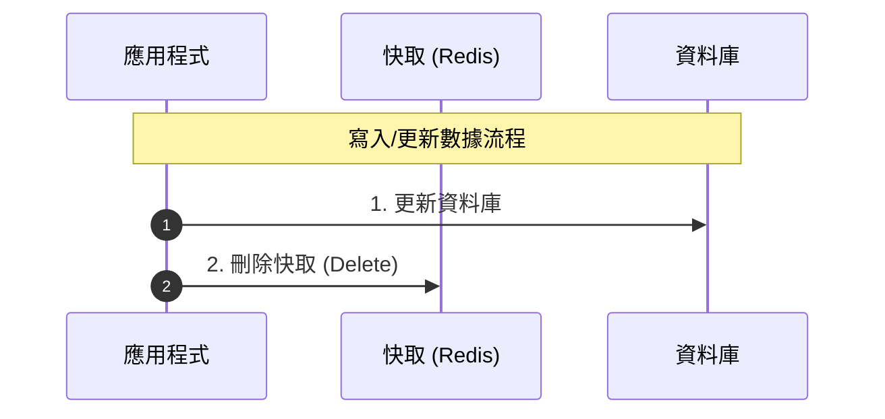
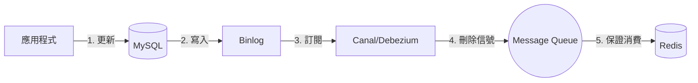

# 快取與資料庫一致性策略 (Cache Consistency)

在引入快取（如 Redis）來減輕資料庫負載的同時，系統面臨的最大挑戰就是**資料的一致性問題**：當資料庫中的資料被新增、修改或刪除時，快取中的資料該如何同步，才能確保使用者不會讀到舊的髒數據？

本文詳細介紹主流的快取讀寫模式、核心爭議（更新 vs. 刪除、先寫 DB vs. 先刪快取）以及解決不一致的工程實踐。

---

## 1. 三種主流快取讀寫模式

### A. Cache Aside Pattern (旁路快取模式) —— 最常用
這是最經典且應用最廣泛的模式，快取的維護邏輯完全由**應用程式**控制。

* **讀取流程**：
  1. 應用程式先查詢快取。
  2. 若快取命中（Hit），直接返回資料。
  3. 若快取未命中（Miss），查詢資料庫，將資料回寫至快取，然後返回。
* **寫入流程**：
  1. 應用程式先更新資料庫。
  2. 應用程式**刪除快取**。

---

### B. Write Through Pattern (直寫快取模式)
應用程式將快取視為主要資料源，所有的讀寫都直接針對快取。

* **運作機制**：
  * 當有寫入操作時，由**快取服務（Cache Provider）**負責**同步且原子地**將資料同時寫入快取與資料庫。
* **優點**：應用程式代碼簡單，不需處理快取與 DB 的同步邏輯。
* **缺點**：寫入延遲較高，因為每次寫入都必須同步寫入磁碟資料庫。

---

### C. Write Behind / Write Back Pattern (後寫快取模式)
與 Write Through 類似，但同步是**非同步**進行的。

* **運作機制**：
  * 應用程式只寫入快取，快取服務立刻返回成功。
  * 快取服務在背景非同步、批量地將變更資料刷回資料庫（例如每隔 5 秒，或積累 1000 筆寫入）。
* **優點**：**極高的寫入吞吐量**與極低的延遲，特別適合日誌收集、遊戲積分等寫入密集的場景。
* **缺點**：存在資料丟失風險（若快取伺服器在資料尚未刷回 DB 前宕機，這部分資料會永久遺失）。

---

## 2. Cache Aside 核心爭議與併發分析

在實作 Cache Aside 時，開發者經常面臨兩個經典的決策問題：

### 爭議一：更新資料時，應該「更新快取」還是「刪除快取」？
* **答案**：應該選擇**刪除快取**。
* **原因一：併發寫入時的不一致風險**
  若有多個併發寫入，更新快取可能導致不一致：
  1. 交易 A 更新 DB（Value = 1）
  2. 交易 B 更新 DB（Value = 2）
  3. 交易 B 更新快取（Value = 2）
  4. 交易 A 更新快取（Value = 1）
  * **結果**：DB 值為 2，快取值為 1，產生**永久不一致**。若使用「刪除快取」，則兩次都會將快取清空，下一次讀取時才會從 DB 讀出最新值 (2) 並寫回。
* **原因二：節約運算開銷 (Lazy Load)**
  若該資料是寫多讀少的，每次修改都去計算並更新快取會浪費 CPU；「刪除快取」能確保只有在真正被讀取時才進行計算。

---

### 爭議二：應該「先更新 DB 再刪除快取」還是「先刪除快取再更新 DB」？
* **答案**：應該優先選擇**先更新 DB，再刪除快取**。

#### ❌ 分析：若「先刪除快取，再更新 DB」
在併發讀寫下，極易發生不一致：
1. 交易 A（寫）要修改資料，先**刪除快取**。
2. 交易 B（讀）進來，發現快取失效，去 **DB 讀取舊資料**。
3. 交易 B 將**舊資料寫回快取**。
4. 交易 A **更新 DB 為新資料**。
* **結果**：快取裡永遠是舊資料，DB 是新資料，直到快取過期。

#### 🟢 分析：若「先更新 DB，再刪除快取」
只有在極端罕見的狀況下才會發生不一致：
1. 快取剛好失效。
2. 交易 A（讀）去 **DB 讀取舊資料**。
3. 交易 B（寫）**更新 DB 為新資料**，並**刪除快取**。
4. 交易 A 將讀到的**舊資料寫回快取**。
* **結果**：不一致。
* **為什麼此情況極罕見？**：因為步驟 3（DB 寫入 + 網路傳輸刪除）的速度通常遠慢於步驟 2~4（記憶體讀寫快取）。交易 A 幾乎百分之百會先完成快取回寫，隨後交易 B 的刪除操作才會到達並清空快取。

---

## 3. 保證一致性的工程實踐

儘管「先更新 DB 再刪除快取」最安全，但在網路延遲、主從延遲或極限併發下，依然有不一致的可能。以下是解決方案：

### 方案 A：延遲雙刪 (Delay Double Delete)
為了解決「先刪除快取再更新 DB」或「讀寫分離主從延遲」導致的舊資料回寫問題：

1. 先刪除快取。
2. 更新資料庫（或等待主從同步完成）。
3. **執行 `Sleep` 延遲一段時間**（例如 500 毫秒，具體時間取決於讀取 DB + 寫回快取的時間，以及主從延遲時間）。
4. **再次刪除快取**。

> 💡 **核心作用**：第二次刪除能確保在步驟 2、3 期間因併發讀取而寫入的「舊快取資料」被徹底清除。

---

### 方案 B：訂閱資料庫 Binlog 異步刪除 (Change Data Capture, CDC)
為了解決「應用程式刪除快取失敗」或想將快取維護與業務邏輯解耦：

1. 應用程式更新資料庫。
2. 資料庫（如 MySQL）產生 Binlog。
3. 透過中間件（如 **Canal** 或 **Debezium**）訂閱資料庫的 Binlog。
4. 訂閱服務解析變更，並將需要失效的 Key 發送至消息佇列 (MQ) 或直接發送指令刪除 Redis 快取。
5. 若刪除失敗，可利用 MQ 的重試機制確保最終刪除成功。

