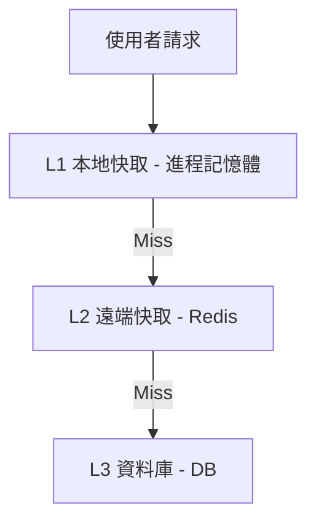
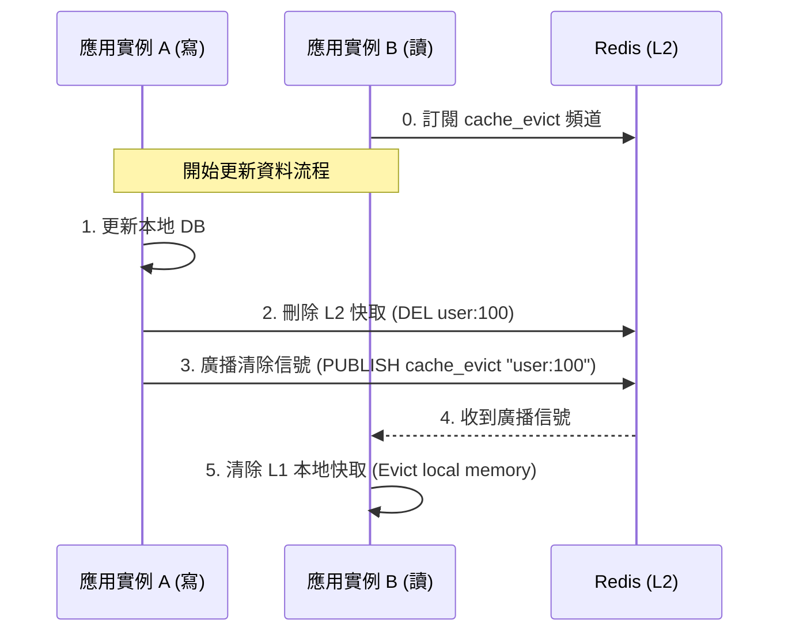

# 本地快取 (Local Cache) vs. 遠端快取 (Redis) 比較

在設計高效能與高可用的系統時，快取的選擇主要分為**本地快取 (Local Cache / 進程內快取)** 與**遠端快取 (Remote Cache / 分佈式快取)**。

理解這兩者的優缺點與權衡，是規劃微服務架構與高併發系統的核心能力。

---

## 1. 基本概念

* **本地快取 (Local Cache)**：
  * 快取資料直接儲存在**應用程式進程（Process）的記憶體空間**中。
  * 代表技術：Go 的 `sync.Map`、`bigcache`、`freecache`；Java 的 `Caffeine`、`Guava Cache`。
* **遠端快取 (Remote Cache)**：
  * 快取資料儲存在**獨立的外部伺服器或集群**中，應用程式透過網路協定進行存取。
  * 代表技術：`Redis`、`Memcached`。

---

## 2. 深度對比表格

| 對比維度 | 本地快取 (Local Cache) | 遠端快取 (Redis) |
| :--- | :--- | :--- |
| **存取延遲** | **極低 (微秒級 $\mu s$)**，直接讀取本機記憶體。 | 較低 (毫秒級 $ms$)，受限於網路傳輸。 |
| **網路與序列化開銷** | **無**（直接存取物件）。 | **有**（需進行 TCP 連接與資料序列化/反序列化）。 |
| **分散式一致性** | **差**（多個副本實例間資料不一致，形成資料孤島）。 | **極佳**（多實例共享同一個快取源，天然一致）。 |
| **儲存容量** | **受限**（受限於單機進程的記憶體上限）。 | **極大**（可透過叢集分片橫向擴展）。 |
| **重啟與部署** | 資料會隨著應用程式重啟而**全部丟失**（冷啟動）。 | 獨立運行，**不受應用程式部署影響**。 |
| **GC 垃圾回收壓力** | **高**（Java/Go 中儲存百萬級物件可能引發 GC 停頓）。 | **無**（Redis 自主管理記憶體，不影響應用進程）。 |
| **架構複雜度** | 極低（無需架設額外服務）。 | 中等（需維護 Redis 集群與高可用）。 |

---

## 3. 核心指標對比剖析

### A. 效能與網路開銷
* **本地快取**擁有絕對的效能優勢。因為它直接讀取記憶體（Heap），不涉及任何網路傳輸（No Network Hop），也不需要進行 JSON、Msgpack 或 Protobuf 的序列化與反序列化。對於**極高頻讀取、且內容不常變動**的資料（例如系統配置、靜態路由），本地快取是首選。
* **Redis** 雖然也非常快，但每次讀取依然需要經歷一次 TCP 網路來回（RTT）與資料序列化開銷，在高併發下容易成為網路頻寬的瓶頸。

### B. 分散式資料一致性
當應用程式進行水平擴展（部署多台 Instance）時：
* **本地快取**會面臨「資料孤島」問題。例如，使用者修改了設定，請求打到 Instance A，A 清除了本地快取；但 Instance B 的本地快取中依然存著舊資料，導致使用者隨後訪問 B 時讀到髒數據。
* **Redis** 作為集中共享的快取，所有 Instance 都向同一個 Redis 節點讀寫，更新或刪除操作立竿見影，不會產生多節點間的資料衝突。

### C. 生命週期與冷啟動
* **本地快取**的生命週期與應用進程綁定。每次發布新版本或自動彈性伸縮（Auto-scaling）導致 Pod 重啟時，本地快取會被清空。這會導致重啟後流量湧入時發生**快取穿透/雪崩**，瞬間壓垮後端資料庫（冷啟動問題）。
* **Redis** 獨立於應用程式。即使微服務重啟 100 次，Redis 中的快取依然安好，能持續為資料庫擋下大量查詢流量。

---

## 4. 最佳實踐：多級快取架構 (Multi-Level Cache)

為了解決「本地快取不一致」與「Redis 網路頻寬開銷大」的問題，現代大型系統常採用**多級快取架構**：

### 多級快取的一致性同步機制（如何同步清理 L1 本地快取）
當資料庫更新時，L2 (Redis) 快取會被刪除。此時，如何通知所有應用實例去同步清除它們的 L1 (本地快取) 呢？

我們可以使用 **Redis 的 Pub/Sub (發布/訂閱)** 功能來同步：

1. **更新寫入**：當某一個實例（如 Instance A）更新 DB 後，它會刪除 L2 (Redis) 快取，並同時向 Redis 的訂閱頻道發送一條廣播消息（例如 `PUBLISH cache_evict_channel "user:100"`）。
2. **異步清除**：其他所有應用實例（Instance B, C...）一直在監聽 `cache_evict_channel`。當收到廣播消息後，它們會**立刻清除自己本地記憶體中的 `user:100` 快取**。
3. **下次讀取**：當使用者下次訪問 Instance B 時，B 發現 L1 快取失效，會向下查詢 L2 (Redis) 或 DB，重新讀取最新值並寫回。這實現了分佈式環境下的多級快取最終一致性。

