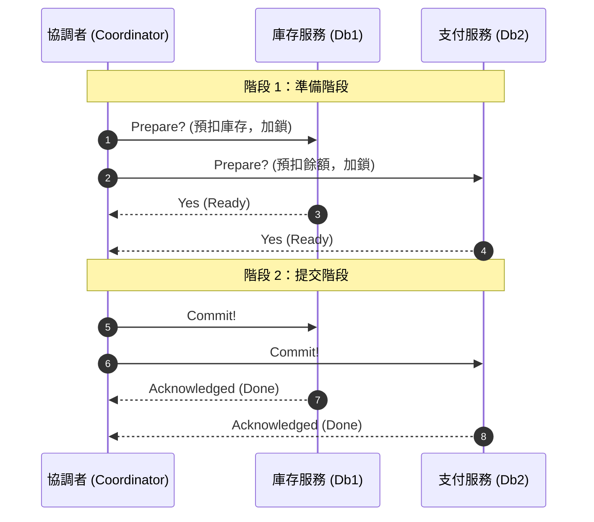
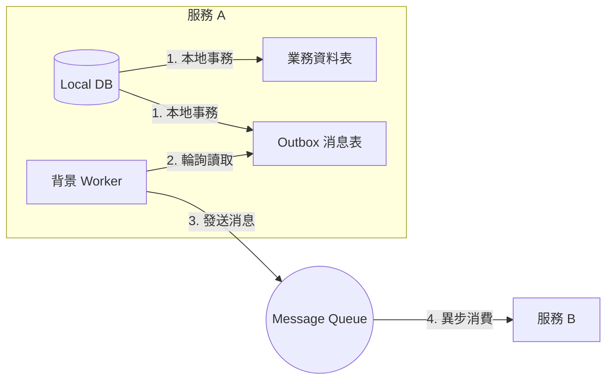

# 分散式交易解決方案 (Distributed Transactions)

在微服務架構中，每個服務通常擁有獨立的資料庫（Database-per-service 模式）。當一個業務流程需要跨多個微服務與資料庫時（例如：下單流程需要同時調用「訂單服務」、「庫存服務」與「支付服務」），傳統的單機資料庫 ACID 交易便無法發揮作用。此時就必須引入**分散式交易**解決方案。

根據對資料一致性強度的要求，分散式交易主要分為**強一致性方案**與**最終一致性（柔性交易）方案**。

---

## 1. 強一致性方案：兩階段提交 (2PC, Two-Phase Commit)

2PC 是一種協議，旨在保證跨多個資料庫節點的交易同時成功或同時失敗。它引入了一個**協調者 (Coordinator)** 與多個**參與者 (Participants)** 的角色。

### 兩個階段的運作流程
1. **準備階段 (Prepare Phase)**：
   * 協調者向所有參與者發送「準備提交」請求。
   * 參與者執行本地交易，鎖定資源，並寫入 Undo/Redo Log（但不提交），然後向協調者回報 `Yes`（可以提交）或 `No`（發生異常）。
2. **提交階段 (Commit Phase)**：
   * **若所有參與者都回報 `Yes`**：協調者向所有人發送「正式提交 (Commit)」指令，參與者執行提交並釋放鎖，回報完成。
   * **若有任何一人回報 `No` 或超時**：協調者發送「回滾 (Rollback)」指令，所有參與者利用 Undo Log 回滾本地交易並釋放鎖。

### 2PC 的致命缺陷
* **同步阻塞**：在準備階段到提交階段之間，所有參與者都持有資料庫鎖。這會極大降低系統併發能力。
* **單點故障**：若協調者在第二階段發送 Commit 指令前突然宕機，所有參與者都會陷入無限期等待與資源鎖定狀態。
* **資料不一致**：在第二階段，若因為網路分區，只有部分參與者收到了 Commit 指令，而其他人沒收到，就會造成嚴重的資料不一致。

> *註：3PC（三階段提交）雖然引入了預提交（PreCommit）階段與超時機制來減少阻塞，但並未徹底解決一致性問題，且設計極其複雜，工業界極少使用。*

---

## 2. 最終一致性方案：Saga 模式

Saga 模式將一個大交易拆分為一系列的**本地交易 (Local Transactions)**。每一個本地交易都直接提交。如果其中某一步失敗，Saga 會以相反的順序執行**補償交易 (Compensating Transactions)**，將先前成功的交易結果「撤銷」。

* **核心概念**：
  * 正常流程：$T_1 \to T_2 \to T_3$ (全部成功，交易結束)。
  * 異常流程：假設 $T_3$ 失敗，Saga 將執行補償交易：$T_1 \to T_2 \to T_3(\text{Fail}) \to C_2 \to C_1$（透過 $C_2$ 與 $C_1$ 還原 $T_2$ 與 $T_1$ 的影響）。

### Saga 的兩種實現方式

#### A. 協同式 (Choreography) —— 事件驅動
* **機制**：沒有中心化的協調者。每個服務在執行完本地交易後，發布一個事件到消息佇列 (MQ)；下一個服務監聽該事件並執行自己的交易。如果發生失敗，失敗的服務發送一個「補償事件」，上游服務聽到後執行補償。
* **優點**：去中心化、服務間低耦合。
* **缺點**：當流程複雜時，事件流會變得混亂，難以理解與追蹤。

#### B. 編排式 (Orchestration) —— 協調者驅動
* **機制**：引入一個中心化的 **Saga Orchestrator (編排器)**。編排器負責調用各個服務，並根據回傳結果決定下一步是調用下一個服務，還是調用補償接口。
* **優點**：業務流程集中在編排器中，易於理解、偵錯與追蹤。
* **缺點**：編排器可能成為單點瓶頸，且服務對編排器產生了依賴。

---

## 3. 最終一致性方案：TCC 模式

TCC 是**應用層**的兩階段提交，特別適合需要對「資金/庫存」進行嚴格預留的場景。它要求每個服務都必須實作三個接口：

1. **Try**：進行業務檢查，並**預留/凍結資源**。
   * 例如：不直接扣除餘額，而是將 100 元凍結（餘額減 100，凍結餘額加 100）。
2. **Confirm**：正式執行業務，**使用 Try 階段預留的資源**。
   * 例如：將凍結的 100 元扣除。因為資源已在 Try 階段預留，Confirm 階段理論上必須百分之百成功。
3. **Cancel**：釋放 Try 階段預留的資源。
   * 例如：取消凍結，將 100 元還回餘額。

### TCC 實作的痛點
* **開發成本極高**：每個業務都必須手動寫三套邏輯（Try/Confirm/Cancel）。
* **冪等性 (Idempotency)**：Confirm 和 Cancel 接口可能會因為網路問題被重複調用，必須保證冪等。
* **空回滾與防懸掛**：
  * **空回滾**：當 Try 根本沒執行（例如超時），Cancel 卻被觸發了，Cancel 邏輯必須能識別並直接返回成功。
  * **懸掛**：當 Cancel 比 Try 先到達（因網路延遲），隨後到達的 Try 必須被拒絕，防止資源被永久凍結。

---

## 4. 本地消息表 (Transactional Outbox Pattern)

本地消息表非常適合「一個核心動作必須觸發其他非核心異步動作」的場景。它利用了**單機資料庫的事務**來保證業務數據與消息發送的一致性。

* **運作機制**：
  1. 在同一個本地資料庫中建立兩張表：`Business Table` 與 `Outbox Table`（消息表）。
  2. 交易開始：在一個**本地事務 (Local Transaction)** 中同時完成：
     * 更新業務資料。
     * 向 `Outbox Table` 寫入一條準備發送的消息。
     * 提交事務。這保證了「業務變更」與「消息記錄」必定同時成功或失敗。
  3. 背景工作（Worker / Debezium / CDC）：定時輪詢 `Outbox Table` 中未發送的消息，將其投遞到 MQ，並在投遞成功後更新狀態或刪除消息。
  4. 下游消費：下游微服務從 MQ 讀取消息，執行相應操作（下游必須做好**防重與冪等**）。

