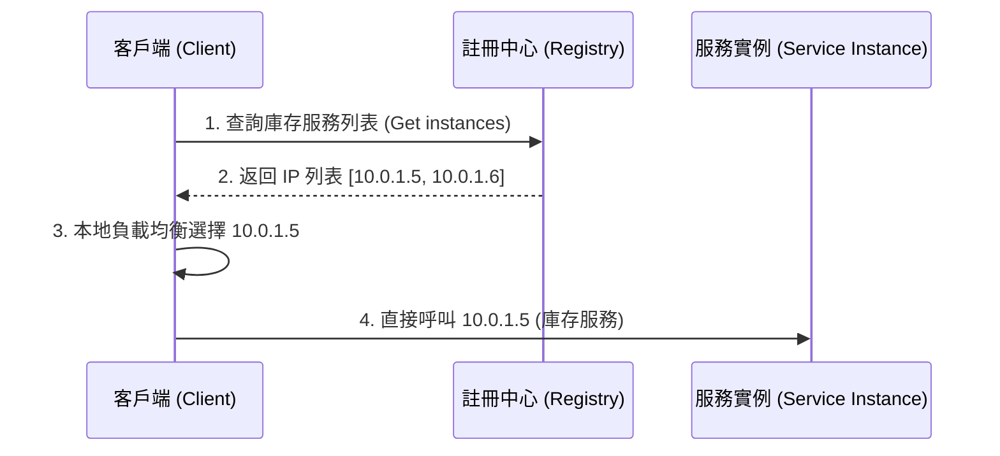
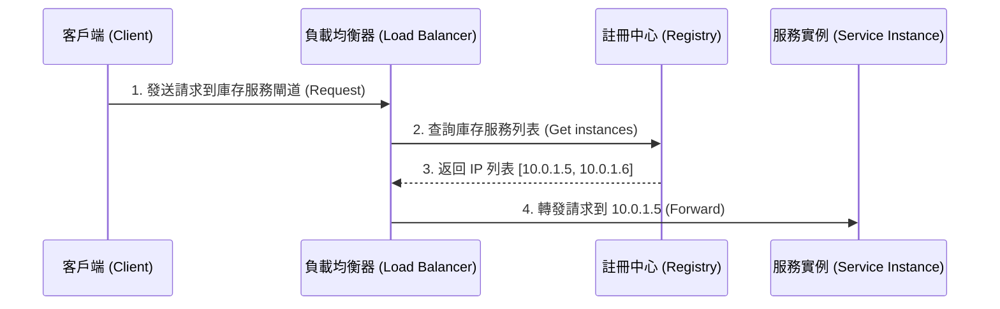

# 負載均衡與服務發現 (Load Balancing & Service Discovery)

在高可靠性與高併發的架構中，單一伺服器節點無法承受所有流量，也存在單點故障 (SPOF) 的風險。因此，我們需要**負載均衡 (Load Balancing)** 將流量均勻分配給後端伺服器集群，並透過**服務發現 (Service Discovery)** 動態管理這些伺服器節點的 IP 變化。

---

## 1. 負載均衡 (Load Balancing) 的層級

根據 OSI 模型，負載均衡器通常在第四層（L4，傳輸層）或第七層（L7，應用層）運作：

### A. L4 負載均衡（四層，傳輸層）
* **運作機制**：僅根據封包的 **IP 地址與 Port（連接埠）** 來決定轉發策略。它不需要解包 HTTP/HTTPS 協議，也不看內容。
* **技術代表**：LVS、F5、Nginx (Stream 模組)、AWS NLB。
* **優點**：效能極高、CPU 開銷低，因為不進行 SSL 解密與內容解析。
* **缺點**：缺乏靈活性。無法根據 URL 路徑、Cookie、標頭或 User-Agent 進行路由分配。

### B. L7 負載均衡（七層，應用層）
* **運作機制**：深入到應用層協議（如 HTTP/HTTPS），解析並根據 **URL、Header、Cookie、甚至是請求內容** 來做路由。
* **技術代表**：Nginx、HAProxy、Traefik、AWS ALB。
* **優點**：非常靈活。可以實現：
  * **路徑路由**：將 `/api/v1/users` 路由到用戶服務，將 `/api/v1/orders` 路由到訂單服務。
  * **會話保持 (Session Sticky)**：根據 Cookie 將同一個使用者的請求固定發送到同一台伺服器。
  * **SSL 卸載 (SSL Offloading)**：在負載均衡器端完成 HTTPS 解密，減輕後端伺服器負擔。
* **缺點**：效能消耗比 L4 大，因為需要解析 HTTP 內容與進行加密解密。

---

## 2. 常用負載均衡演算法

1. **輪詢 (Round Robin)**：
   * 按順序將請求依次分配給後端伺服器。適用於每台伺服器效能都相同且請求處理時間均勻的場景。
2. **加權輪詢 (Weighted Round Robin)**：
   * 根據伺服器的硬體效能分配不同的權重（Weight），效能好的伺服器分配更多請求。
3. **最小連接數 (Least Connections)**：
   * 優先將新請求發送給目前活躍連線數（Active Connections）最少的伺服器。適合處理耗時較長的請求（如大檔案下載、長連接）。
4. **源 IP 哈希 (IP Hash)**：
   * 根據客戶端 IP 計算哈希值，將同一 IP 的請求永遠固定發送到同一台伺服器。常用於傳統 Session 共享難度高時的「會話粘滯」。
5. **一致性哈希 (Consistent Hashing)**：
   * 常用於分佈式快取節點（如 Memcached/Redis Cluster）的負載分配。能確保在快取節點增加或減少時，只有極少數的快取 Key 發生失效，避免快取雪崩。

---

## 3. 服務發現 (Service Discovery)

在動態的雲端環境或 Kubernetes 中，服務實例會因為自動伸縮（Auto-scaling）、故障重啟或滾動更新，導致其 **IP 地址與 Port 隨時都在動態變化**。硬編碼（Hardcode）配置檔是不可行的，因此需要服務動態註冊與發現機制。

服務發現系統包含三個核心組件：
1. **服務註冊中心 (Service Registry)**：儲存所有可用服務實例 IP/Port 的資料庫（如 Consul、Eureka、etcd、ZooKeeper）。
2. **服務註冊 (Service Registration)**：服務啟動時主動向註冊中心報告自己的位置；關閉時註銷。
3. **服務發現 (Service Discovery)**：其他服務查詢註冊中心以獲取目標服務的最新實例列表。

---

## 4. 服務發現的兩種模式

### A. 客戶端發現模式 (Client-side Discovery)
* **機制**：客戶端直接向「服務註冊中心」查詢可用實例列表，然後在客戶端內部使用負載均衡演算法（如 Netflix Ribbon）選擇一個 IP，並直接發送請求。
* **代表技術**：Spring Cloud (Eureka + Ribbon)。
* **優點**：少了一層網路轉發（Network Hop），效能較好；客戶端可以完全控制負載均衡策略。
* **缺點**：客戶端程式碼需要集成服務發現的 SDK，增加了程式碼的侵入性與對特定程式語言的依賴。

### B. 服務端發現模式 (Server-side Discovery)
* **機制**：客戶端只需將請求發送給一個負載均衡器（或 API Gateway）。負載均衡器向「服務註冊中心」查詢後，自動將請求轉發給後端實例。
* **代表技術**：Kubernetes (K8s Service + kube-proxy)、AWS ELB。
* **優點**：客戶端非常簡單，不需要集成註冊中心 SDK，對任何語言都通用。
* **缺點**：請求多經過了一層負載均衡器的轉發，存在額外的網路延遲。

---

## 5. 健康檢查 (Health Check) 機制

註冊中心不能只管註冊，還必須保證實例是「活著」的。
* **主動回報（心跳機制 Heartbeat）**：服務實例每隔數秒（如 30 秒）向註冊中心發送一次心跳包。若超時未收到，註冊中心會將該實例標記為下線。
* **被動探針（Probe）**：註冊中心定期向服務實例的特定 Health 接口（例如 `GET /actuator/health` 或 `GET /ping`）發送 HTTP 請求或 TCP 連線嘗試，確認其健康狀態。
* **下線處理**：一旦實例不健康，註冊中心會將其從可用列表中移除，並通知訂閱了該服務的負載均衡器，確保有問題的實例不再接收任何外部流量。
