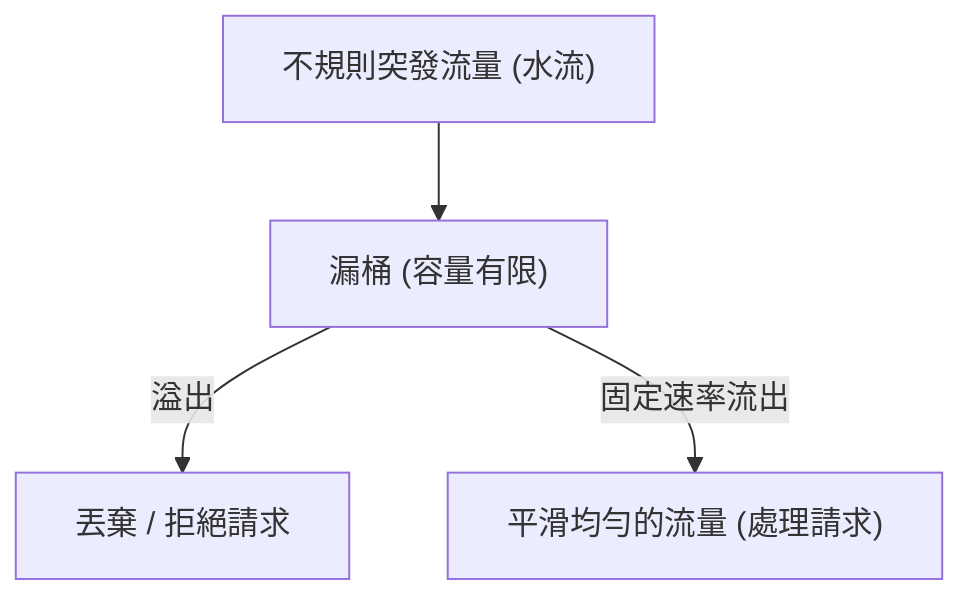
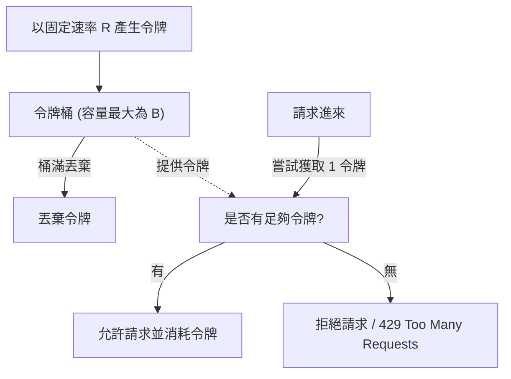

# 常用限流演算法 (Rate Limiting Algorithms)

在建構高可靠的 API 服務與微服務架構時，為了防止伺服器因突發流量（如搶購、DDoS 攻擊）崩潰，並確保資源的公平分配，我們必須引入**限流 (Rate Limiting)** 機制。

目前工業界最常使用的四種限流演算法為：**固定窗口**、**滑動窗口**、**漏桶** 與 **令牌桶**。

---

## 1. 固定窗口計數器 (Fixed Window Counter)

這是最簡單直觀的限流演算法。

* **運作機制**：
  * 將時間劃分為固定的週期（例如：每分鐘為一個窗口）。
  * 在當前窗口內維護一個計數器。每來一個請求，計數器加 1。
  * 若計數器超過限制值（例如：限制 100 次/分），則拒絕後續請求。
  * 進入下一個時間週期時，計數器重設為 0。
* **致命缺點：臨限點流量翻倍（Spike at Boundaries）**：
  * 假設限制為 `100次/分`。攻擊者在 `00:59` 發送了 100 個請求（通過限制），隨後在下一個窗口的 `01:01` 又發送了 100 個請求（計數器重置後通過）。
  * 雖然在各個窗口內都沒超限，但在這短短 **2 秒內系統承受了 200 個請求**，超出了系統原本預設每分鐘最大 100 個請求的承載力。

---

## 2. 滑動窗口計數器 (Sliding Window Counter)

為了解決固定窗口在邊界上的流量突發問題而設計。

* **運作機制**：
  * 時間窗口不再是固定的，而是隨著當前時間持續前進。
  * 通常使用 Redis 的 Sorted Set (ZSET) 實現：將每個請求的時間戳 (Timestamp) 記錄下來。
  * 當新請求進來時：
    1. 移除 ZSET 中早於「當前時間 - 窗口長度」（例如：當前時間前 1 分鐘）的所有記錄。
    2. 計算 ZSET 中剩餘的記錄總數。
    3. 若數量未超限，則接受請求並將當前時間戳寫入 ZSET；否則拒絕。
* **優點**：徹底解決了固定窗口的邊界流量翻倍問題，限流精準度極高。
* **缺點**：記憶體開銷大。因為需要記錄每一個請求的時間戳，若併發量大，ZSET 會佔用非常可觀的記憶體空間。

---

## 3. 漏桶演算法 (Leaky Bucket)

漏桶演算法強制**平滑流量輸出**，將不穩定的突發流量轉化為均勻的流量輸出。

* **運作機制**：
  * 想像一個漏桶，水（請求）以任意速度流入桶中。
  * 桶的底部有一個洞，水以**固定的速率**流出（處理請求）。
  * 桶有容量限制。如果流入的速度太快，水滿出來了（溢出），多餘的水（請求）會被直接丟棄（拒絕）或排隊等待。
* **優點**：
  * 輸出的速率是**絕對均勻且固定**的，能完美保護下游的「慢速系統」（例如寫入速率受限的資料庫）。
* **缺點**：
  * **無法應對突發流量 (Burst)**。即使後端伺服器此時非常空閒，請求依然必須以固定的速率慢慢排隊漏出，無法充分利用伺服器的瞬間處理潛能。

---

## 4. 令牌桶演算法 (Token Bucket) —— 推薦首選

令牌桶演算法是目前 Web 應用（如 Spring Cloud Gateway、Nginx）最常用的限流方案。它在**限制長期平均速率**的同時，**允許一定程度的突發流量**。

* **運作機制**：
  * 系統以**固定的速率**（例如：每秒 10 個）往一個容量有限的桶（例如：最多存 50 個）中投放**令牌 (Tokens)**。
  * 桶滿時，多餘的令牌會被丟棄。
  * 每個請求進來時，必須從桶中**取走一個令牌**。
  * 若桶中沒有令牌，則拒絕請求。
* **優點**：
  * **支援突發流量**：如果桶此時是滿的（存了 50 個令牌），當瞬間來了 50 個請求時，它們可以立刻拿到令牌並被同時處理。
  * **長期平均速率受控**：突發流量消耗完桶內積累的令牌後，後續的請求速率就只能受限於令牌產生的速率（每秒 10 個）。

---

## 5. 四種演算法對比總結

| 特性 | 固定窗口 | 滑動窗口 | 漏桶演算法 | 令牌桶演算法 |
| :--- | :--- | :--- | :--- | :--- |
| **實現難度** | 最簡單 | 中等 | 中等 | 中等 |
| **記憶體開銷** | 極低 (只需一個 Counter) | 高 (需存所有時間戳) | 低 | 低 (只需記錄剩餘令牌數與上次更新時間) |
| **邊界突發流量** | 無法處理 (翻倍) | **可完美處理** | **可完美處理** | **可完美處理** |
| **支援瞬間突發** | 支援 | 支援 | ❌ 不支援 (強制平滑) | **精準支援 (最大為桶容量 B)** |
| **輸出速率** | 不固定 | 不固定 | **絕對固定** | 不固定 (在 B 範圍內可突發) |
| **適用場景** | 簡單的 API 限流 | 低併發的精準限流 | **保護慢速寫入系統 (如 DB/Log)** | **通用 API 網關、Web 應用保護** |
