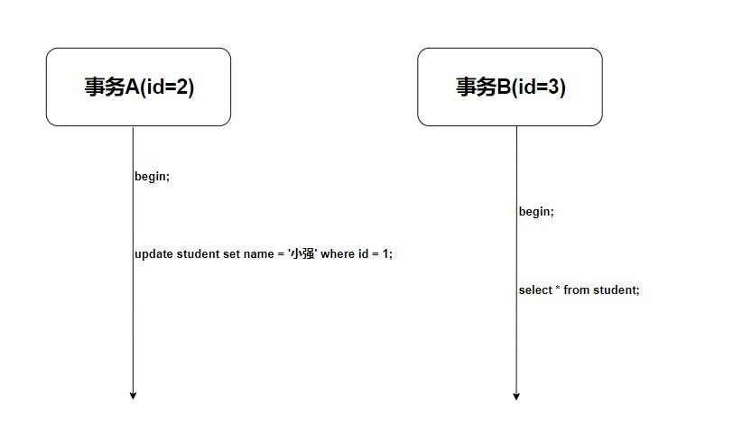
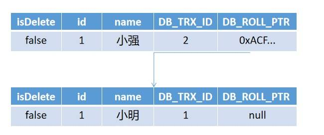
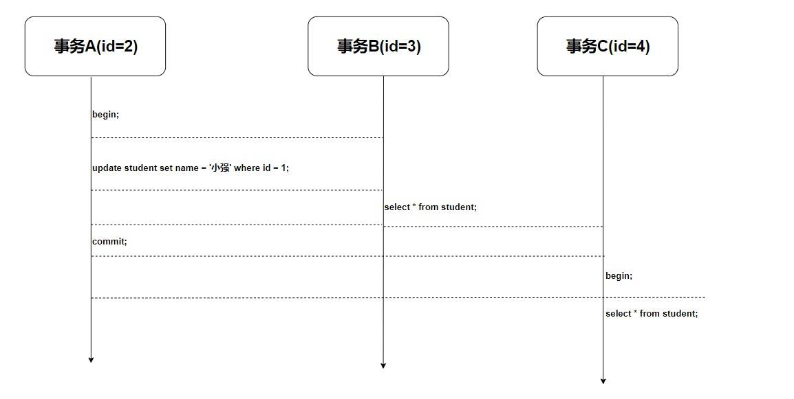

# MySQL InnoDB MVCC 机制的原理及实现

## introduction

MVCC（Multi-Version Concurrency Control，多版本並發控制）是一種用於資料庫管理系統的並發控制方法。它允許**多個交易同時讀取數據**，而不會**阻塞其他讀取或寫入操作**，從而提高了系統的並發性能。MVCC 通過保存數據的多個版本來實現，讓不同的交易能夠看到它們應該看到的數據版本，而不會相互干擾。

### MVCC 的两种读形式

在讲 MVCC 的实现原理之前，我觉很有必要先去了解一下 MVCC 的两种读形式。

+ 快照读：读取的只是当前事务的可见版本，简单的 select 操作就是快照读(select * from table where id = xxx)。
+ 当前读：读取的是当前版本，比如更新/插入/删除操作

比如：

```sql
 select * from table where xxx lock in share mode
 select * from table where xxx for update
 insert into table (xxx,xxx) values (xxx,xxx)
 delete from table where id = xxx
```

## MVCC 的实现原理

我们先来看一看 MySQL 在建表的时候 innoDB 创建的真正的三个隐藏列吧。

|RowID	|DB_TRX_ID	|DB_ROLL_PTR|	id|	name	|password|
| ---- | ---- | ---- | ---- | ---- | ----|
|自动创建的id	|事务id	|回滚指针|	id|	name|	password|

- RowID：隐藏的自增ID，当建表没有指定主键，InnoDB会使用该RowID创建一个聚簇索引。
- DB_TRX_ID：最近修改（更新/删除/插入）该记录的事务ID。
- DB_ROLL_PTR：回滚指针，指向这条记录的上一个版本。

> 其实还有一个删除的flag字段，用来判断该行记录是否已经被删除。

而 MVCC 使用的是其中的 事务字段，回滚指针字段，是否删除字段。我们来看一下现在的表格(isDelete是我自己取的，按照官方说法是在一行开头的content里面，这里其实位置无所谓，你只要知道有就行了)。


|isDelete	|DB_TRX_ID	|DB_ROLL_PTR|	id	|name	|password|
| ---- | ---- | ---- | ---- | ---- |---- |
|true/false|	事务id	|回滚指针	|id|	name	|password|

那么如何通过这三个字段来实现 MVCC 的 可见性算法 呢？
还差点东西！ undoLog(回滚日志) 和 read-view(读视图)。

- undoLog: 事务的回滚日志，是 可见性算法 的非常重要的部分，分为两类。
    - insert undo log：事务在插入新记录产生的undo log，当事务提交之后可以直接丢弃
    - update undo log：事务在进行 update 或者 delete 的时候产生的 undo log，在快照读的时候还是需要的，所以不能直接删除，只有当系统没有比这个log更早的read-view了的时候才能删除。ps：所以长事务会产生很多老的视图导致undo log无法删除 大量占用存储空间。
- read-view: 读视图，是MySQL秒级创建视图的必要条件，比如一个事务在进行 select 操作(快照读)的时候会创建一个 read-view ，这个read-view 其实只是三个字段。
    - alive_trx_list(我自己取的)：read-view生成时刻系统中正在活跃的事务id。
    - up_limit_id：记录上面的 alive_trx_list 中的最小事务id。
    - low_limit_id：read-view生成时刻，目前已出现的事务ID的最大值 + 1。

其实主要思路就是：当生成read-view的时候如何去拿获取的 DB_TRX_ID 去和 read-view 中的三个属性(上面讲了)去作比较。我来说一下三个步骤，如果不是很理解可以参考着我后面的实践结合着去理解。

- 首先比较这条记录的 DB_TRX_ID 是否是 小于 up_limit_id 或者 等于当前事务id。如果满足，那么说明当前事务能看到这条记录。如果大于则进入下一轮判断
- 然后判断这条记录的 DB_TRX_ID 是否 大于等于 low-limit-id。如果大于等于则说明此事务无法看见该条记录，不然就进入下一轮判断。
- 判断该条记录的 DB_TRX_ID 是否在活跃事务的数组中，如果在则说明这条记录还未提交对于当前操作的事务是不可见的，如果不在则说明已经提交，那么就是可见的。

> 如果此条记录对于该事务不可见且 ROLL_PTR 不为空那么就会指向回滚指针的地址，通过undolog来查找可见的记录版本。


## 範例

### 準備數據

首先我创建了一个非常简单的表，只有id和name的学生表。

|id	|name|
|----|----|
|学生id|	学生姓名|

这个时候我们将我们需要的隐藏列也标识出来，就变成了这样

|isDelete	|id|	|name	|DB_TRX_ID	|DB_ROLL_PTR|
|----|----|----|----|----|----|
|是否被删除	|学生id	|学生姓名|	创建删除更新该记录的事务id	|回滚指针|

这个时候插入三行数据，将表的数据变成下面这个样子。

|isDelete	|id|	name|	DB_TRX_ID|	DB_ROLL_PTR|
|----|----|----|----|----|
|false	|1	|小明	|1	|null
false	|2	|小方	|1|	null
false	|3|	小张	|1|	null

### 示例



使用过 MySQL 的都知道，因为隔离性，事务 B 此时获取到的数据肯定是这样的。

|id|	name|
|----|----|
1	|小明
2	|小方
3	|小张

为什么事务A未提交的修改对于事务B是不可见的，MVCC 是如何做到的？我们用刚刚的可见性算法来实验一下。
我们假设事务A的事务id为2，事务B的id为3。
然后事务A进行了更新操作，如图所示，更新操作创建了一个新的版本并且新版本的回滚指针指向了旧的版本




最后事务B进行了快照读，注意，这是我们分析的重点。

首先，在进行快照读的时候我们会创建一个 read-view (忘记回去看一下那三个字段) 这个时候我们的 read-view 是:
```bash
  up-limit-id = 2
  alive-trx-list = [2,3]
  low-limit-id = 4
```

然后我们获取那两个没有被修改的记录(没有顺序，这里为了一起解释方便), 我们获取到(2,小方)和(3,小张)这两条记录，发现他们两的 `DB_TRX_ID = 1`,  我们先判断 DB_TRX_ID 是否小于 `up-limit-id` 或者等于当前事务id ,  发现 1<2 小于 up-limit-id ，则可见 直接返回视图。
  
然后我们获取更改了的数据行:


其实你也发现了这是一个链表，此时链表头的 DB_TRX_ID 为 2,我们进行判断 2 < 2 不符合，进入下一步判断, 判断 DB_TRX_ID >= low_limit_id 发现此时是 2 >= 4 不符合 故再进入下一步,此时判断 Db_TRX_ID 是否在 alive_trx_list 活跃事务列表中，发现这个 DB_TRX_ID 在活跃列表中，所以只能说明该行记录还未提交，不可见。最终判断不可见之后通过回滚指针查看旧版本，发现此时 DB_TRX_ID 为1,故再次进行判断 DB_TRX_ID < up-limit-id ,此时 1 < 2 符合 ，所以可见并返回, 所以最终返回的是

|id	|name|
|----|----|
1	|小明
2	|小方
3	|小张

我们再来验证一下，这个时候我们将事务A提交，重新创建一个事务C并select。

我们预期的结果应该是这样的

|id	|name|
|----|----|
1	|小强
2	|小方
3	|小张

这个操作的流程图如下



这个时候我们再来分析一下 事务c产生的 read-view。

这个时候事务A已经提交，所以事务A不在活跃事务数组中，此时 read-view 的三个属性应该是

```bash
 up-limit-id = 3
 alive-trx-list = [3,4]
 low-limit-id = 5
```

- 跟上面一样，我们首先获取(2,小方)和(3,小张)这两条记录，发现他们两的 DB_TRX_ID = 1，此时 1 < up-limit-id = 3，故符合可见性，则返回。
- 然后我们获取刚刚被修改的id为1的记录行，发现链表头部的 DB_TRX_ID 为 2, 此时 2 < up-limit-id = 3 故也符合可见性，则返回。

所以最终返回的就是

|id	|name|
|----|----|
1	|小强
2	|小方
3	|小张

## Reference
1. https://github.com/lifei6671/interview-go/blob/master/mysql/mysql-mvcc.md
2. https://juejin.im/post/5da8493ae51d4524b25add55
