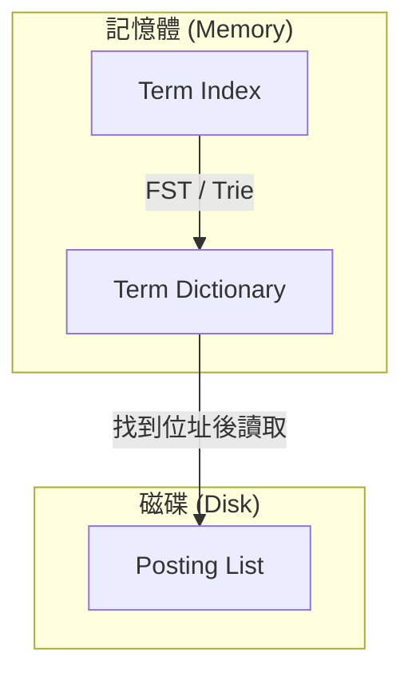

# Inverted Index (倒排索引)

倒排索引（Inverted Index）是現代全文搜尋引擎（例如 Elasticsearch、Lucene）的核心資料結構。它主要用於解決「如何在海量文字資料中，快速找到包含特定關鍵字的文檔」這一問題。

---

## 1. 正向索引 vs. 倒排索引

在理解倒排索引之前，我們可以先對比傳統的**正向索引 (Forward Index)**。

### 正向索引 (Forward Index)
* **核心概念**：從「文檔 (Document)」出發，記錄每個文檔包含了哪些「單字 (Terms/Tokens)」。
* **結構範例**：
  | 文檔 ID (DocID) | 內容 (Content) | 解析後的單字列表 (Terms) |
  | :--- | :--- | :--- |
  | 1 | I love coding | `["I", "love", "coding"]` |
  | 2 | Coding is fun | `["coding", "is", "fun"]` (不分大小寫) |
  | 3 | I love fun coding | `["I", "love", "fun", "coding"]` |
* **查詢痛點**：如果我們要搜尋包含 `fun` 的文檔，資料庫必須掃描（Scan）所有的文檔，並逐一檢查其單字列表，這在資料量極大時效能非常低。

### 倒排索引 (Inverted Index)
* **核心概念**：從「單字 (Terms/Tokens)」出發，記錄每個單字出現在哪些「文檔 (Document)」中。
* **結構範例**：
  | 單字 (Term) | 出現的文檔 ID 列表 (Posting List) |
  | :--- | :--- |
  | i | `[1, 3]` |
  | love | `[1, 3]` |
  | coding | `[1, 2, 3]` |
  | is | `[2]` |
  | fun | `[2, 3]` |
* **查詢優勢**：當搜尋關鍵字 `fun` 時，只需在倒排索引中直接定位到 `fun`，便能立即得知文檔 2 與文檔 3 包含該字，無需掃描所有文檔。

---

## 2. 倒排索引的核心組成

一個工業級的倒排索引結構通常包含以下三個主要層級：

### 1. Posting List (倒排列表)
記錄單字在文檔中出現的詳細資訊，通常包含：
* **DocID**：出現該單字的文檔編號。
* **TF (Term Frequency)**：該單字在該文檔中出現的次數（用於相關性評分，如 BM25）。
* **Position**：單字在文檔中的位置（用於片語查詢、鄰近查詢，例如 `love` 緊跟在 `i` 後面）。
* **Offset**：單字在原始文字中的起點與終點偏移量（用於搜尋結果的高亮顯示 Highlight）。

### 2. Term Dictionary (單字字典)
將所有文檔解析出來的單字進行去重與排序（一般按字典順序），並記錄每個單字對應的 Posting List 在磁碟中的位置。
* 由於單字量可能非常龐大，Term Dictionary 通常儲存在磁碟中。

### 3. Term Index (單字索引)
為了避免在磁碟中遍歷龐大的 Term Dictionary，系統會在記憶體中維護一個 Term Index。
* 它通常使用 **FST (Finite State Transducer)** 或 **Trie 樹** 結構，將單字的前綴進行壓縮儲存。
* 查詢時先在記憶體中的 Term Index 找到單字在 Term Dictionary 中的大致範圍（或 Block 位置），再到磁碟中讀取詳細的 Term Dictionary 與 Posting List。

---

## 3. 倒排索引的建立與查詢流程

### 建立索引（寫入時）
1. **分詞 (Tokenization)**：將文檔內容拆解為獨立的詞彙。
2. **語言處理 / 標準化 (Normalization)**：
   * 轉為小寫 (Lowercase)。
   * 去除停用詞 (Stop words，如 `a`, `an`, `the`, `is` 等無實質搜尋意義的字)。
   * 詞幹提取 (Stemming，例如將 `coding`, `coded` 還原為 `code`)。
3. **寫入索引**：統計單字頻率與位置，並更新或寫入至對應的 Posting List 中。

### 執行搜尋（查詢時）
1. **搜尋詞分析**：對使用者的輸入進行相同的分詞與標準化處理（例如輸入 `Coding` 會轉為 `coding`）。
2. **單字查找**：透過 Term Index 快速定位到 Term Dictionary，並獲取 `coding` 的 Posting List。
3. **集合運算**：
   * 若搜尋 `love AND coding`：將 `love` 的 Posting List `[1, 3]` 與 `coding` 的 Posting List `[1, 2, 3]` 進行**交集 (Intersection)** 運算，得到 `[1, 3]`。
   * 若搜尋 `love OR fun`：將兩者的 Posting List 進行**聯集 (Union)** 運算。
4. **相關性評分 (Scoring)**：根據 TF-IDF 或 BM25 演算法計算文檔評分，並依評分高低排序回傳給使用者。

---

## 4. 應用場景與實作

倒排索引不僅應用在專屬的全文搜尋引擎中，也逐步融入了許多現代資料庫：

* **Elasticsearch / Lucene**：最典型的代表，每個 Field 預設都會建立倒排索引以支援強大的全文檢索。
* **PostgreSQL GIN (Generalized Inverted Index)**：
  * 廣義倒排索引，常用於加速陣列（Array）、全文檢索以及 JSONB 格式的查詢。
  * 詳細應用可參考 [PostgreSQL JSON 與 JSONB 使用指南](file:///e:/code/TechSummary/DB/Postgres/json.md#L43-L60) 中的 GIN 索引章節。
* **MySQL Full-Text Index**：MySQL 的 InnoDB 引擎也支援全文索引，底層同樣是基於倒排索引原理實作。

---

## 5. 優缺點評估

### 優點
* **檢索速度極快**：查詢複雜度與文檔總量無直接線性關係，特別適合 PB 等級的全文搜尋。
* **靈活的布林與片語查詢**：能高效進行交集、聯集、排除（NOT）等集合操作。

### 缺點
* **寫入與更新開銷大**：因為每次新增或修改文檔，都需要重新分詞並將各單字插入到對應的 Posting List 中。因此搜尋引擎通常會使用 Segment 快照與背景合併（Segment Merge）機制來優化寫入效能。
* **儲存空間佔用多**：除了原始資料，還需要額外儲存 Term Index、Term Dictionary 和 Posting List 等多種輔助結構。
