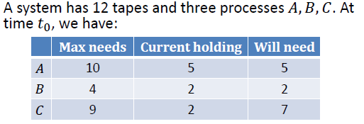
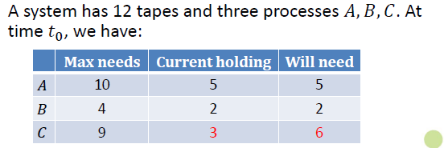

# Deadlock 

## 簡介
又譯為死鎖，電腦科學名詞。當兩個以上的運算單元，雙方都在等待對方停止執行，以取得系統資源，但是沒有一方提前退出時，就稱為死結。在多工作業系統中，作業系統為了協調不同執行緒，能否取得系統資源時，為了讓系統正常運作，必須要解決這個問題

## 可能發生的地方

Database transection， redis分布式鎖，程式內建的鎖皆有可能發生

## 原因
產生Deadlock有四個必要條件，只有滿足下面四個條件，Deadlock才可能發生，反之四個條件成立不一定會發生Deadlock。

+ 禁止搶占（no preemption）：系統資源不能被強制從一個行程中退出。
+ 持有和等待（hold and wait）：一個行程可以在等待時持有系統資源。
+ 互斥（mutual exclusion）：資源只能同時分配給一個行程，無法多個行程共享。
+ 循環等待（circular waiting）：一系列行程互相持有其他行程所需要的資源。

## 簡化範例
+ example1
    
    + 剩下 12-(5+2+2)=3 free
    + 剛好 B 需要 2 個就給他 => 等他做完會釋放 5 個
    + 5 個可以給 A => A 做完釋放 10 個， 就可以給 C 用了
    + <B,A,C>是一個 safe state
+ example2
    
    + 剩下 12-(5+2+3)=2 free
    + 剛好 B 需要 2 個就給他 => 等他做完會釋放 4 個
    + 但是 A、C 都的需要都 > 4
    + 所以會有 deadlock

## 如何消除
以下是一些消除死鎖的參考方式

+ 在一些允許共享資源的程式上，可不需要Mutual exclusion。 (例如readfile)
+ 程式必須一次拿走所需的全部資源或著等待。
+ 資源持有時間限時
+ 使用Banker's Algorithm
    + syntax 說明
    + available: 資源1~n的可用數量
    + max_demand: processes 1~k對資源的最大需求量
    + allocation: 各系統佔領多少資源
    + need: 各系統還需多少資源, need = max - allocation
    + 範例代碼(多種資源)
    ```
    def is_safe_state(available, max_demand, allocation, need, processes):
        work = available[:]
        finish = [False] * len(processes)
        safe_sequence = []

        while len(safe_sequence) < len(processes):
            allocated = False
            for i in range(len(processes)):
                if not finish[i] and all(need[i][j] <= work[j] for j in range(len(work))):
                    work = [work[j] + allocation[i][j] for j in range(len(work))]
                    finish[i] = True
                    safe_sequence.append(processes[i])
                    allocated = True
            if not allocated:
                return False, []
        
        return True, safe_sequence

    processes = ['P0', 'P1', 'P2', 'P3', 'P4']
    available = [3, 3, 2]
    max_demand = [
        [7, 5, 3], [3, 2, 2], [9, 0, 2], [2, 2, 2], [4, 3, 3]
    ]
    allocation = [
        [0, 1, 0], [2, 0, 0], [3, 0, 2], [2, 1, 1], [0, 0, 2]
    ]
    need = [[max_demand[i][j] - allocation[i][j] for j in range(len(available))] for i in range(len(processes))]

    safe, sequence = is_safe_state(available, max_demand, allocation, need, processes)
    if safe:
        print(f"The system is in a safe state. Safe sequence is: {sequence}")
    else:
        print("The system is not in a safe state.")
    ```


