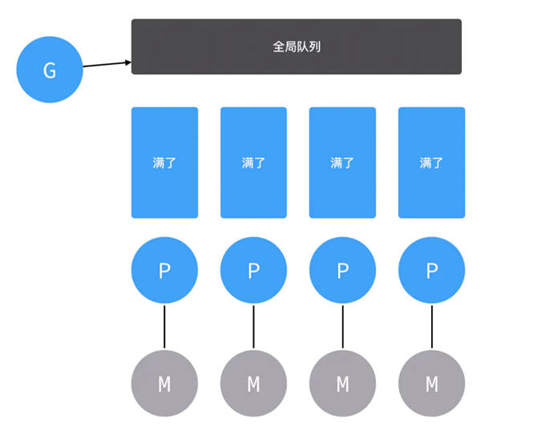
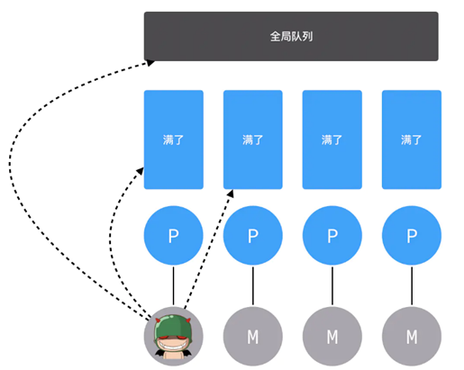
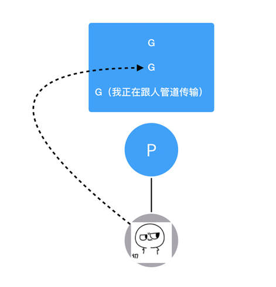

# GMP調度原理

## GPM代表了三个角色，分别是Goroutine、Processor、Machine。
+ Goroutine：就是咱们常用的用go关键字创建的执行体，它对应一个结构体g，结构体里保存了goroutine的堆栈信息
+ Machine：表示操作系统的线程
+ Processor：表示处理器，有了它才能建立G、M的联系

## 執行過程
+ 首先，默认启动四个线程四个处理器，然后互相绑定。这个时候，一个Goroutine结构体被创建，在进行函数体地址、参数起始地址、参数长度等信息以及调度相关属性更新之后，它就要进到一个处理器的队列等待发车。

+ 假如有很多G，都塞满了怎么办呢？那就不把G塞到处理器的私有队列里了，而是把它塞到全局队列里（候车大厅）。

+ M这边还要疯狂往外取，首先去处理器的私有队列里取G执行，如果取完的话就去全局队列取，如果全局队列里也没有的话，就去其他处理器队列里偷。

+ 如果哪里都没找到要执行的G呢？那M就会因为太失望和P断开关系，然后去睡觉（idle）了。
那如果两个Goroutine正在通过channel做一些恩恩爱爱的事阻塞住了怎么办，难道M要等他们完事了再继续执行？显然不会，M并不稀罕这对Go男女，而会转身去找别的G执行。

## reference
+ https://alanzhan.dev/post/2022-01-24-golang-goroutine/
+ https://yousec995.github.io/2021/07/25/Goroutine%E5%8E%9F%E7%90%86/