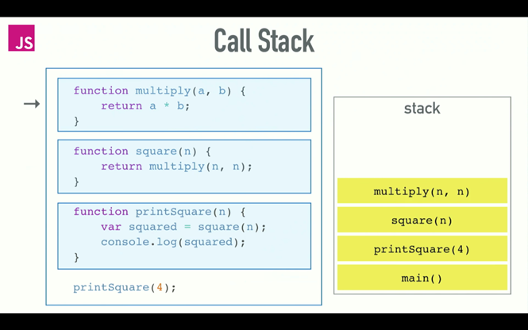
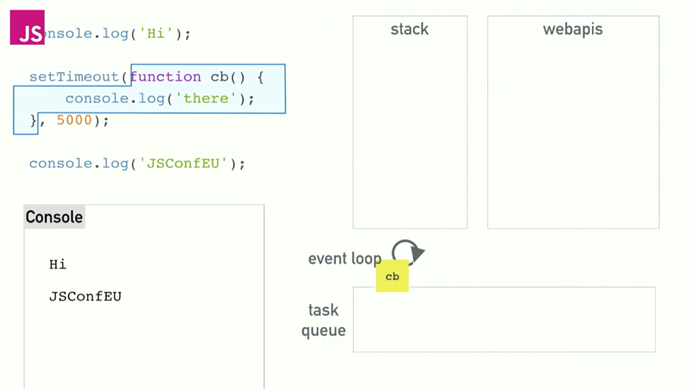

# Node.js Async 特性

## 同步函數/異步函數

+ 同步函數：同步函數按照它們在程式碼中的順序執行。當執行耗時任務(I/O操作或複雜計算)，它會阻礙後續程式碼的執行直到完成。

+ 異步函數：允許程式碼在等待某個操作完成時繼續執行其他任務。在JS裡，非同步程式設計可以透過回呼函數、Promise 和 async/await 等方式實現。

## callstack 

會執行所有同步函數，同步函數間以stack方式排序 (無窮迴圈會造成 MaxRange : Maximum Call Stack Size Exceeded)

## macrotask/microtask: 

在事件循环模型中，有两种类型的任务队列，微任务队列中的任务优先于宏任务队列中的任务执行。

+ microtask : promise，async function
+ microtask : other function 

## 事件循環（event loop）: 

如果堆疊（stack）是空的，它便把佇列（Task Queue）中的第一個項目放到堆疊當中；堆疊便會去執行這個項目。

## async/await

在 JavaScript 中，async 函数是一种用于处理异步操作的特殊函数，它允许你使用 await 关键字等待异步操作完成。如果執行 async函數時不用await，則會在執行函數內部
時遇到await會暫停執行。

## Promise :

JavaScript 中的 Promise 是一种用于处理异步操作的对象。Promise 对象代表一个异步操作的最终完成（或失败）及其结果值。Promise 使得异步操作的处理更加直观和简洁，避免了“回调地狱”（callback hell）的问题。

+ 狀態 :  待定（Pending），已完成（Fulfilled），已拒绝（Rejected）。

+ 功能 : 
    +  then 方法用于指定当 Promise 变为已完成状态时要执行的回调函数。
    +  catch 方法用于指定当 Promise 变为已拒绝状态时要执行的回调函数。
    +  finally 方法用于指定不管 Promise 最终状态如何都会执行的回调函数。

+ 其他函數 :
    +  Promise.all : 接收一个 Promise 数组，当所有 Promise 都变为已完成状态时，返回一个新的 Promise，该 Promise 的状态变为已完成；或者只要有一個Promise變為Rejected，則该 Promise 的状态变为已拒絕。
    +  Promise.race : 接收一个 Promise 数组，当第一个 Promise 变为已完成或已拒绝状态，返回一个新的 Promise，状态和结果与第一个完成或拒绝的 Promise 一致。
    +  Promise.allSettled : 接收一个 Promise 数组，当所有 Promise 都变为已完成或已拒绝状态时，返回一个新的 Promise，并且返回的 Promise 始终为已完成状态，结果是每个 Promise 的状态和结果的数组。
    +  Promise.any : 接收一个 Promise 数组，当第一个 Promise 变为已完成状态时，返回一个新的 Promise，该 Promise 的状态和结果与第一个完成的 Promise 一致。如果所有 Promise 都被拒绝，Promise.any 返回的 Promise 会被拒绝，并带有一个聚合错误（AggregateError）。
