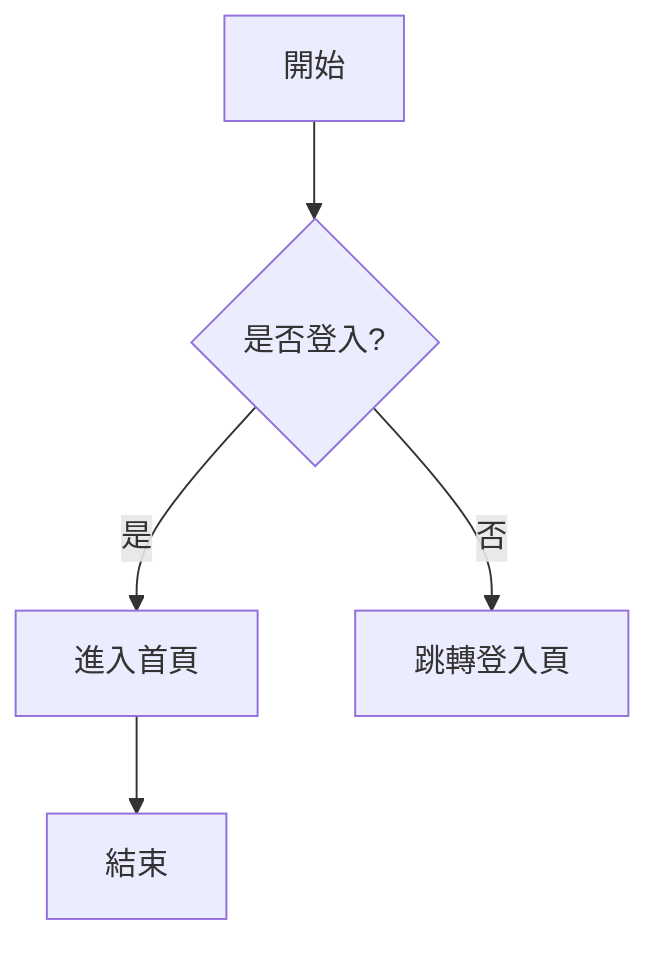
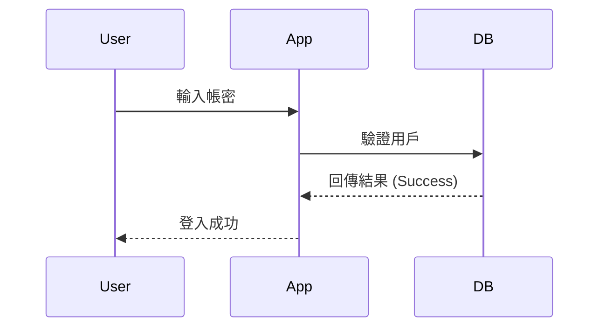
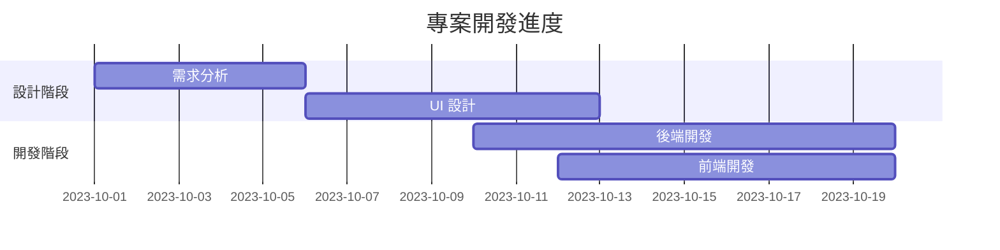
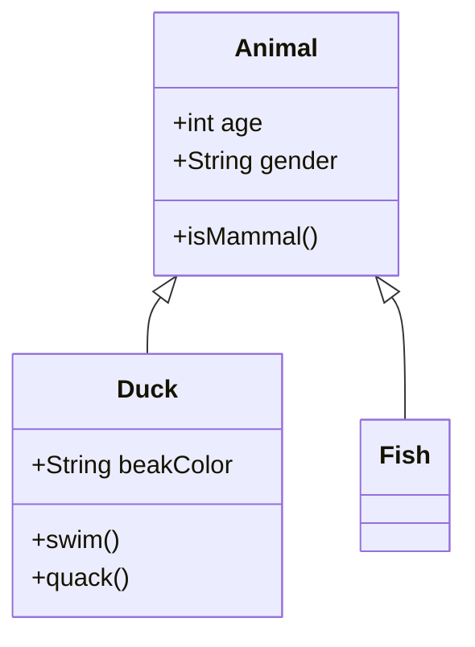

# Mermaid 簡介

Mermaid 是一款基於 JavaScript 的圖表工具，它使用類 Markdown 的文字語法來定義圖表，並自動渲染成 SVG 或 Canvas 格式。

## 1. 為什麼要使用 Mermaid？

- **文字即圖表**：不需要使用複雜的繪圖軟體，只需寫簡單的文字。
- **版本控制友好**：圖表定義是純文字，可以輕鬆放入 Git 進行版本追蹤與 Diff 對比。
- **Markdown 整合**：大多數現代 Markdown 編輯器（如 VS Code, GitHub, GitLab, Obsidian）都原生支援 Mermaid 渲染。
- **維護成本低**：修改圖表只需修改幾行文字，不需要重新匯出圖片。

---

## 2. 常用圖表範例

### A. 流程圖 (Flowcharts)

用於展示邏輯判斷或操作流程。

### B. 序列圖 (Sequence Diagrams)

常用於描述物件或服務之間的互動時序。

### C. 甘特圖 (Gantt Charts)

用於專案時程管理。

### D. 類別圖 (Class Diagrams)

用於描述程式架構中的類別關係。

---

## 3. 使用建議

1. **保持簡潔**：圖表過於複雜時會難以閱讀，建議將大圖拆分成多個子圖。
2. **語法練習**：可以利用 [Mermaid Live Editor](https://mermaid.live/) 進行即時編輯與預覽。
3. **搭配註釋**：在 Mermaid 代碼區塊上方加上簡短的說明文字，幫助他人理解圖表重點。
